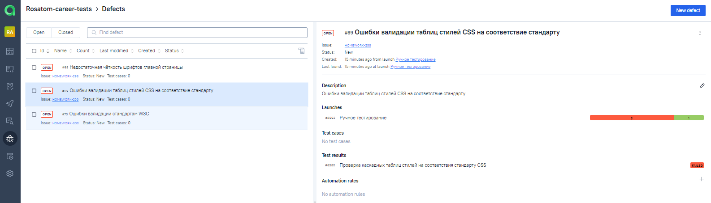

# Проект по тестированию сайта "TELE2"
> <a target="_blank" href="https://tele2.ru/">Ссылка на сайт TELE2</a>


#### Список проверок, реализованных в автотестах
- [x] Проверка поисковой строки
- [x] Проверка смены региона
- [x] Проверка авторизации
- [x] Проверка тарифа Мой онлайн+ 12_2021
- [x] Добваление двух тарифов в корзину
- [x] Удаление тарифа из корзины
- [x] Параметризованные тесты
- [x] Проверка добавления товара в корзину (API)
- [x] Проверка отправки смс с кодом (mobile)
- [x] Проверка кнопки "Вход по паролю" (mobile)

## Проект реализован с использованием
Java Gradle IntelliJ IDEA Selenide Selenoid JUnit5 Jenkins Allure Report Allure TestOps Telegram Jira


# Запуск автотестов выполняется на сервере Jenkins
> <a target="_blank" href="https://jenkins.autotests.cloud/job/TELE2/">Ссылка на проект в Jenkins</a>

### Параметры сборки

* "-Dtag=${TAG}"
* "-Dbase_url=${BASE_URL}"
* "-DremoteUrl=${REMOTE_URL}"
* "-DbrowserSize=${BROWSER_SIZE}"
* "-Dbrowser=${BROWSER}"
* "-DbrowserVersion=${BROWSER_VERSION}"

### Для запуска автотестов в Jenkins


#### 2. Выбрать пункт **Собрать с параметрами**
#### 3. В случае необходимости изменить параметры, выбрав значения из выпадающих списков
#### 4. Нажать **Собрать**
#### 5. Результат запуска сборки можно посмотреть в отчёте Allure


[//]: # (## Локальный запуск автотестов)

[//]: # (Пример командной строки:)

[//]: # (```bash)

[//]: # (gradle clean ui_tests -Dlogin=user1 -Dpassword=1234 -DtestUrl=selenoid.autotests.cloud/wd/hub/)

[//]: # (```)

[//]: # ()
[//]: # (Получение отчёта:)

[//]: # (```bash)

[//]: # (allure serve build/allure-results)

[//]: # (```)

# Полная статистика по прохождению тестпланов, отчёты и приложения к ним хранятся в Allure TestOps
> <a target="_blank" href="https://allure.autotests.cloud/project/804">Сссылка на проект в AllureTestOps</a> (запрос доступа admin@qa.guru)

### Тест-планы проекта

### Кейсы тест-плана выполнения ручного тестирования

### Кейсы тест-плана выполнения автотестирования

### Общий список всех кейсов, имеющихся в системе (без разделения по тест-планам и виду выполнения тестирования)

### Пример dashboard с общими результатами тестирования

### В том числе сводная статистика запусков


### Пример отчёта выполнения одного из автотестов

#### *После окончания выполнения автотестов по каждому из них в отчёте доступны скриншоты и исходный код страницы, лог консоли браузера и видеозапись выполнения теста.*

### Пример видеозаписи прохождения теста


## По результатам ручного тестирования выявлены дефекты, зафиксированные в соответствующих задачах AllureTestOps
### Тест план выполнения ручного тестирования

### Сводные результаты ручного тестирования

### Пример описания дефекта в Allure TestOps

### Список выявленных дефектов, открытых как задачи в Allure TestOps


# Результаты выполнения тестов и информация о выявленных дефектах интегрированы с Atlassian Jira
> <a target="_blank" href="https://jira.autotests.cloud/browse/HOMEWORK-286">Ссылка на задачу в Jira</a> (запрос доступа admin@qa.guru)

Задачи на выявленные дефекты оформлены как подзадачи к данной. Связаны с соответствующими дефектами в Allure TestOps


# Настроено автоматическое оповещение о результатах сборки Jenkins в Telegram-бот


:heart: <a target="_blank" href="https://qa.guru">qa.guru</a><br/>
:blue_heart: <a target="_blank" href="https://t.me/qa_automation">t.me/qa_automation</a>
